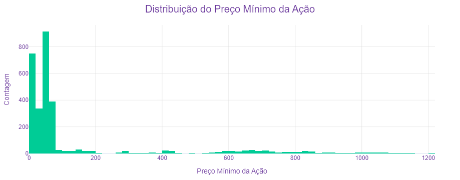
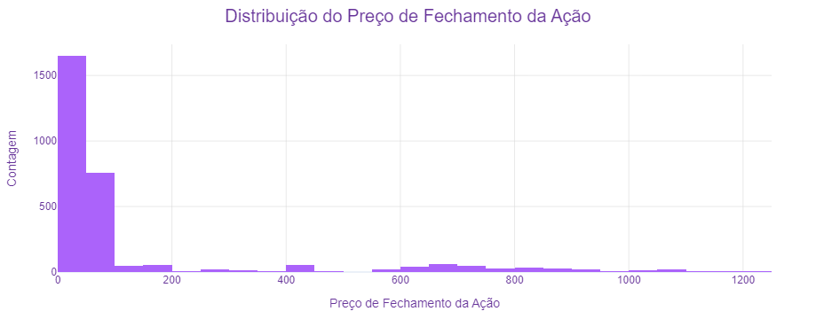
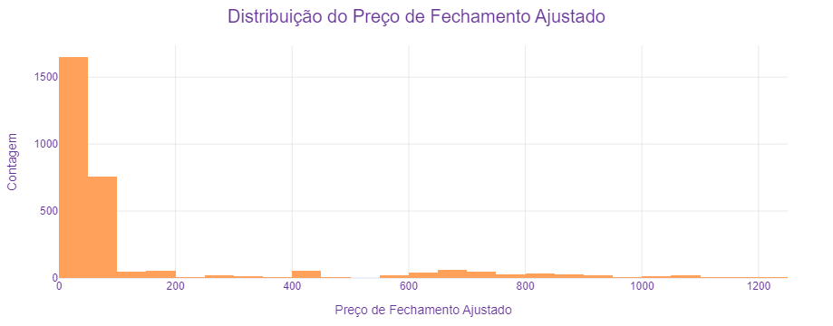
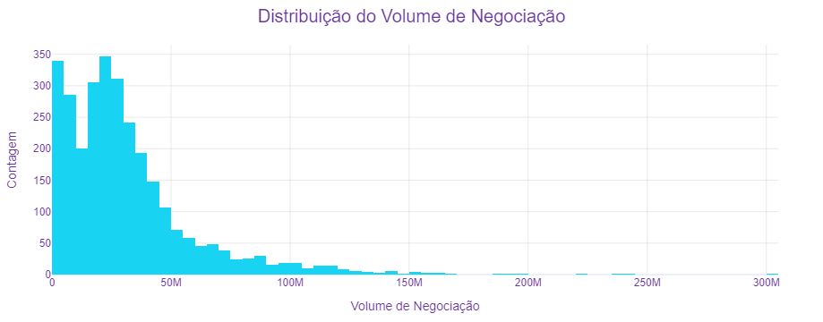
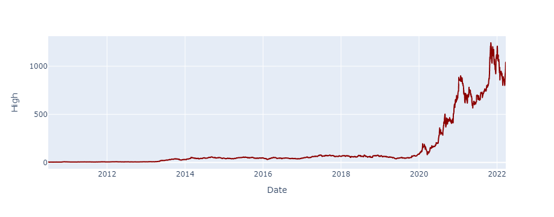
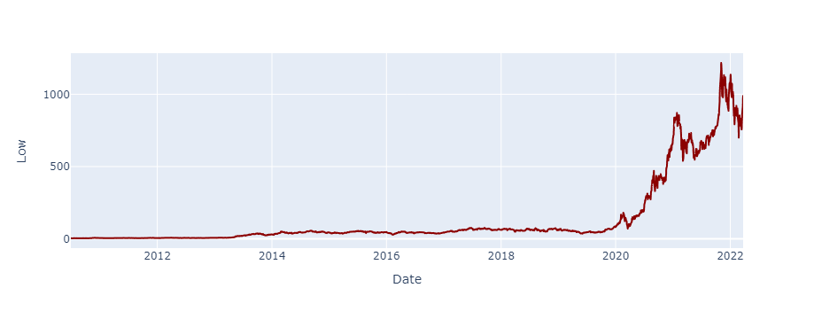
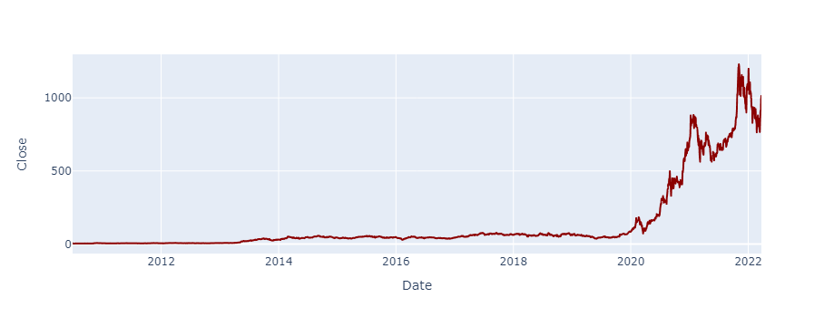
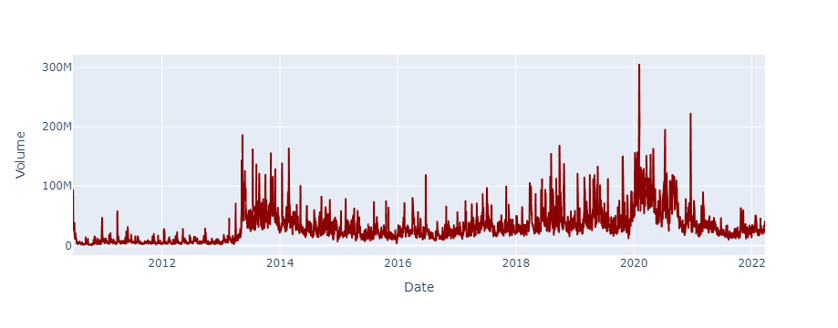
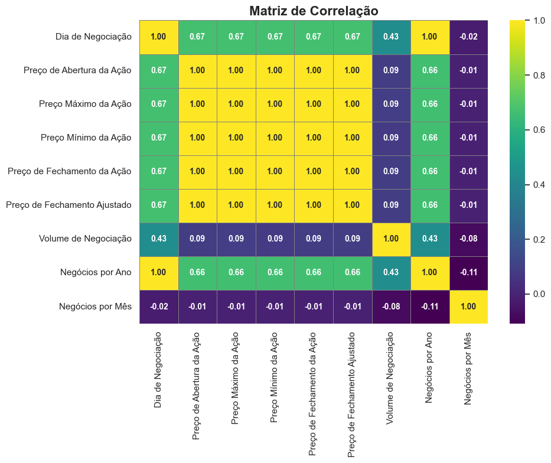

## Análise do Desempenho das Ações da Tesla

Este projeto visa analisar o desempenho histórico das ações da Tesla (TSLA) utilizando técnicas de análise de dados e visualização. O objetivo é identificar padrões e tendências que possam fornecer insights sobre o comportamento do mercado e ajudar investidores a tomar decisões informadas. Para isso, foram utilizados dados históricos de preços das ações da Tesla e uma variedade de ferramentas de visualização para apresentar os resultados de maneira clara e intuitiva.

## Descrição do Dataset:

Conjunto de dados: [disponível no Kaggle](https://www.kaggle.com/datasets/varpit94/tesla-stock-data-updated-till-28jun2021)

A Tesla, Inc. é uma empresa americana de veículos elétricos e energia limpa com sede em Palo Alto, Califórnia. Os produtos atuais da Tesla incluem carros elétricos, armazenamento de energia em baterias desde o nível doméstico até o nível de rede elétrica, painéis solares e telhas solares, além de outros produtos e serviços relacionados.

Este conjunto de dados fornece dados históricos das ações da TESLA INC. (TSLA). Os dados estão disponíveis em nível diário. A moeda utilizada é USD.

Glossário do conjunto de dados:

* `Date` -  A data do dia de negociação.
* `Open` - O preço de abertura da ação nesse dia de negociação.
* `High` - O preço mais alto que a ação atingiu durante esse dia de negociação.
* `Low` - O preço mais baixo que a ação atingiu durante esse dia de negociação.
* `Close`- O preço de fecho da ação nesse dia de negociação.
* `Adj Close`- O preço de fecho ajustado, que tem em conta quaisquer acções empresariais, tais como desdobramentos de acções, dividendos, etc.
* `Volume`- O volume de negociação, ou seja, o número de acções negociadas durante esse dia de negociação.

## Etapas do Projeto:

* **Conhecendo o Dataset**: Importação das bibliotecas necessárias e leitura do conjunto de dados.
* **Análises Preliminares**: Exploração inicial dos dados, com o objetivo de responder perguntas e obter insights importantes.
* **Visualização dos Dados**: Utilização de gráficos e histograma para entender a distribuição dos dados e identificar possíveis outliers. Também plotagem de gráficos de dispersão para observar as relações entre as variáveis.

## Análise Exploratória

Do autor:
- Primeiro, criei colunas que representam cada ano. Depois, usei essas colunas para filtrar o volume de transações por ano. Com essas informações, obtive um gráfico para mostrar como o volume de transações varia de um ano para o outro."

---

Do autor:
- Após criar colunas para os anos, usei essas colunas para filtrar o preço de abertura das ações de cada ano e fazer um gráfico de linhas com anotações. O gráfico mostra como o preço de abertura das ações varia de um ano para o outro, e podemos ver que o valor mais alto foi em 2021.

---

Do auto:
- Após criar colunas representando os anos, utilizei essas colunas para filtrar o preço de fechamento da ação de negociação ano a ano. Em seguida, gerei um gráfico de linhas com anotações para visualizar a diferença no preço de fechamento entre os anos. A partir desse gráfico, é possível observar que o preço de fechamento mais alto ocorreu em 2021.

---

- Após criar colunas para os anos, utilizei essas colunas para filtrar o preço máximo da ação de negociação de acordo com cada ano. Em seguida, gerei um gráfico de linhas com anotações para mostrar a diferença entre os anos com base no preço máximo da ação. A partir desse gráfico, podemos observar que o fechamento máximo ocorreu em 2021.

---

Do autor:
- **Preço Mínimo da Ação:** Após criar colunas para os anos, utilizei essas colunas para filtrar o preço mínimo da ação de negociação para cada ano. Em seguida, gerei um gráfico de linhas com anotações para mostrar a diferença entre os anos com base no preço mínimo da ação. A partir desse gráfico, podemos observar que o preço mais baixo ocorreu em 2010.

- **Diferença entre Fechamento e Abertura:** A partir dos gráficos anteriores que mostram o preço de fechamento e o preço de abertura da ação, podemos ver que a diferença entre esses preços é muito pequena. Portanto, podemos concluir que não há uma diferença significativa entre o preço de abertura e o preço de fechamento.

---

Do autor:
- Podemos observar no gráfico a diferença entre o preço de abertura e o preço de fechamento da ação.

---

Do autor:
- Podemos ver no gráfico a diferença entre o preço mais alto e o preço mais baixo da ação.

## Distribuições

Do autor:
- Para saber onde os dados estão concentrados no gráfico para cada coluna.

---

Do autor: 

Para identificar cada coluna que atingiu determinado preço em cada ano:

- O Preço de Abertura da Ação
- O Preço Mais Alto da Ação
- O Preço Mais Baixo da Ação
- O Preço de Fechamento da Ação
- O Preço de Fechamento Ajustado
- O Volume de Negociações

---

Do autor:
- Preço de Abertura, Preço Máximo, Preço Mínimo, Preço de Fechamento e Preço de Fechamento Ajustado têm correlação perfeita (1.00), indicando que essas variáveis se movem em conjunto.
- Correlação baixa (0.09) com os preços das ações, sugerindo que o volume não é um bom indicador de variação de preço.
- Correlação alta (1.00) com o Dia de Negociação, e moderada (0.66) com os preços das ações, indicando que o número de negócios ao longo do ano está associado ao movimento dos preços.
- Correlação muito baixa ou negativa com outras variáveis, indicando pouca relação com os preços das ações e o volume de negociação.
- Correlação moderada (0.67) com os preços das ações, sugerindo a influência de fatores temporais nos preços.

## Resumo dos Insights:

**Crescimento Significativo:**

- Desde o início do período analisado, as ações da Tesla mostraram um crescimento significativo no preço. Isso reflete o aumento no interesse e investimento na empresa ao longo dos anos.
- A volatilidade também é evidente, com variações significativas nos preços de abertura e fechamento em vários dias. Esse comportamento pode ser atribuído a diversos fatores, incluindo notícias da empresa, lançamentos de produtos, resultados financeiros e mudanças no mercado de veículos elétricos.

---

**Volume de Negociação:**

- O volume de negociação varia consideravelmente ao longo do tempo, com alguns dias apresentando volumes excepcionalmente altos. Isso pode indicar eventos importantes, como anúncios de lucros, lançamentos de novos produtos ou mudanças na administração.

---

**Tendências de Preço:**

- Ao longo do período analisado, houve várias tendências de alta e baixa nos preços das ações. Identificar esses padrões pode ajudar a entender os ciclos de mercado e prever movimentos futuros.

---

**Impacto de Eventos Externos:**

- Eventos externos, como mudanças nas políticas governamentais relacionadas a veículos elétricos, pandemias ou crises econômicas, também têm um impacto significativo no preço das ações da Tesla.

## Conclusão

A análise histórica dos dados das ações da Tesla revela um crescimento impressionante no preço das ações, refletindo a inovação contínua e a expansão da empresa no mercado de veículos elétricos. A volatilidade dos preços destaca a sensibilidade das ações a eventos internos e externos, sugerindo que investidores devem estar atentos a esses fatores ao tomar decisões de investimento. Além disso, os volumes de negociação elevados em certos dias indicam a presença de eventos significativos que influenciam o comportamento do mercado. Em resumo, a Tesla continua a ser uma empresa de grande interesse no mercado financeiro, com potencial significativo para crescimento futuro, mas também com riscos associados à sua volatilidade.
